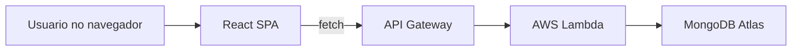
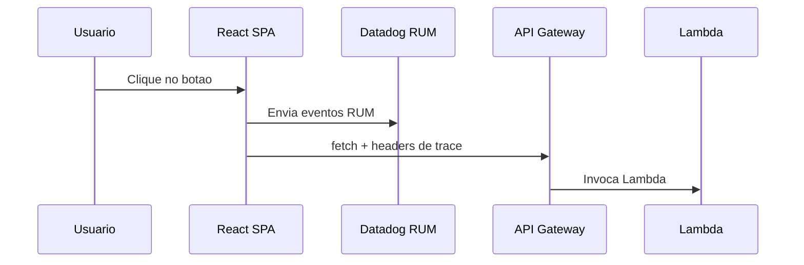
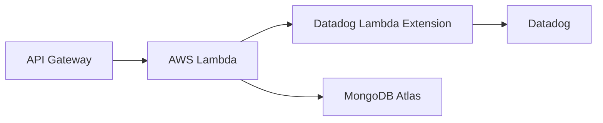

# Instrumentacao Datadog - Demo Omie

Este documento explica, de forma simples, como foi feita a instrumentacao
das Lambdas e do RUM no Datadog e como esse projeto simula o ambiente real.

## Visao geral da arquitetura (simulacao do ambiente real)

Esse projeto replica a arquitetura do cliente:

- Frontend: React SPA (rotas 100% client-side)
- Backend: AWS API Gateway (HTTP API) + AWS Lambda (Python)
- Banco: MongoDB Atlas
- Observabilidade: Datadog (RUM + APM + Logs + DBM)

Nada foi alterado no desenho da arquitetura. O que fizemos foi apenas adicionar
camadas de observabilidade (SDK no front e extension nas Lambdas) para
correlacionar tudo.

### Imagem 1 - Arquitetura (simulada)



## Objetivo da instrumentacao

- Correlacionar clique no frontend com chamadas ao backend
- Enxergar traces fim a fim (front -> API Gateway -> Lambda -> MongoDB)
- Capturar logs das Lambdas direto no Datadog
- Exibir queries e metricas do Mongo (DBM)

## 1) Frontend (RUM + Session Replay)

**O que foi feito**
- Instalado o SDK do Datadog RUM no frontend.
- RUM inicializado no `frontend/src/rum.js`.
- Correlacao com traces habilitada via `allowedTracingUrls`.
- Session Replay habilitado (100% das sessoes).
- Privacidade configurada para mascarar apenas inputs.

**Por que e simples**
- Um unico arquivo de configuracao (`rum.js`) e variaveis no `.env`.
- Sem necessidade de proxy ou backend extra.

### Imagem 2 - Instrumentacao RUM



**Variaveis no `.env`**
```
VITE_DD_RUM_APP_ID=...
VITE_DD_RUM_CLIENT_TOKEN=...
VITE_DD_SITE=datadoghq.com
VITE_DD_SERVICE=frontend-spa
VITE_DD_ENV=demo
VITE_DD_VERSION=1
VITE_DD_RUM_REPLAY=true
VITE_DD_RUM_REPLAY_SAMPLE_RATE=100
```

**Correlacao**
- O RUM injeta headers de trace nas chamadas para o API Gateway.
- Isso conecta o trace do frontend com o trace do backend.

## 2) Backend (Lambda + APM + Logs)

**O que foi feito**
- Lambdas instrumentadas com `datadog-lambda` e `ddtrace`.
- Uso da **Datadog Lambda Extension** (sem integracao AWS).
- Logs enviados direto para o Datadog (`DD_SERVERLESS_LOGS_ENABLED=true`).
- CORS configurado para aceitar os headers de trace do RUM.

**O que e a Datadog Lambda Extension**
- E uma camada oficial da Datadog que roda junto com a Lambda.
- Ela coleta logs, traces e metricas e envia direto para o Datadog.
- Evita integracao AWS (sem CloudWatch Forwarder).

**Por que e simples**
- So adiciona uma layer (Extension) e variaveis de ambiente.
- Nada de agentes host-based nem integracao AWS.

**Variaveis principais**
```
DD_API_KEY=...
DD_SITE=datadoghq.com
DD_ENV=demo
DD_SERVICE=backend-api
DD_VERSION=1
DD_TRACE_ENABLED=true
DD_LOGS_INJECTION=true
DD_SERVERLESS_LOGS_ENABLED=true
```

**Resultado**
- Traces completos com spans das Lambdas.
- Logs correlacionados com `trace_id` e `span_id`.

### Imagem 3 - Instrumentacao no backend



## 3) MongoDB (APM + DBM)

### 3.1 APM (traces de query)
**O que foi feito**
- O `ddtrace` faz patch do `pymongo`.
- Spans do Mongo aparecem automaticamente no trace da Lambda.

### 3.2 DBM (metricas e performance do banco)
**O que foi feito**
- Um Datadog Agent roda em uma EC2 com acesso ao Atlas.
- O Agent coleta metricas e queries do Mongo (DBM).

**Por que e simples**
- Um unico host com Agent.
- Sem mudanca no app.

## 4) Fluxo fim a fim (correlacao)

1. Usuario clica no botao no React
2. RUM gera trace e envia headers
3. API Gateway recebe e envia para Lambda
4. Lambda continua o trace e chama Mongo
5. Spans e logs aparecem correlacionados no Datadog
6. DBM mostra performance do Mongo no mesmo painel

## 5) Resumo para o cliente (simplicidade)

- Front: 1 SDK + variaveis de ambiente
- Backend: 1 Extension + vars
- Mongo: 1 Agent em EC2
- Correlacao automatica (sem codigo extra)

## 6) Arquivos onde foi feito

- Frontend:
  - `frontend/src/rum.js`
  - `frontend/src/main.jsx`
- Backend:
  - `backend/template.yaml`
  - `backend/src/*/app.py`
  - `backend/src/lib/mongo.py`
- README:
  - `README.md` (passo a passo)
